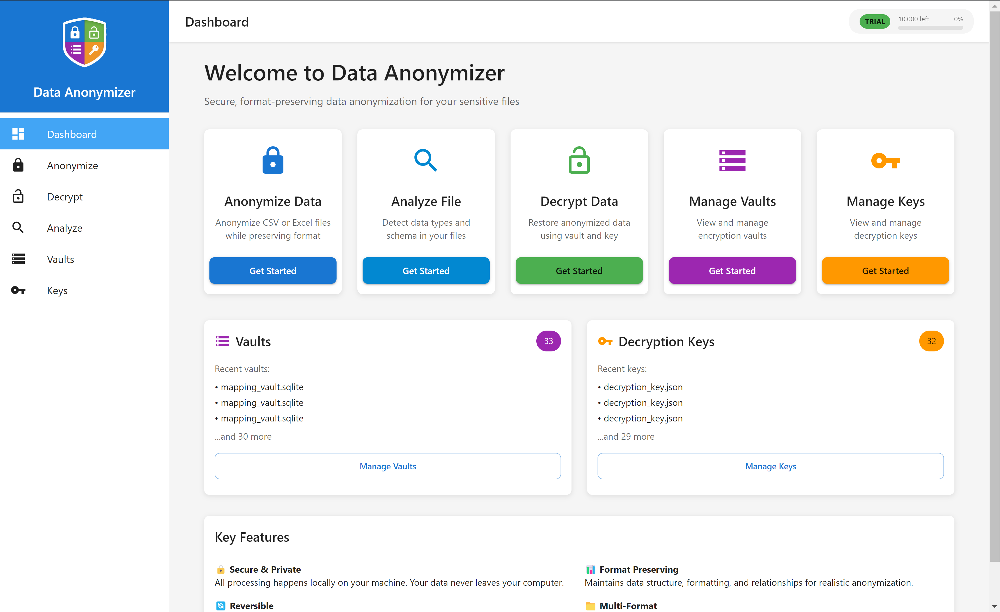
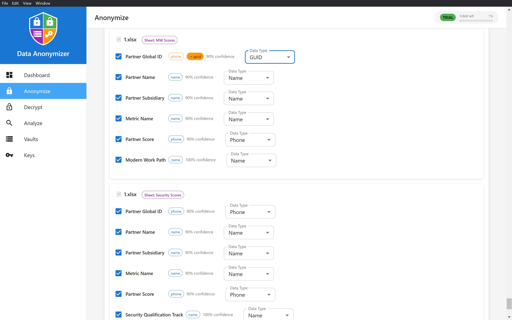
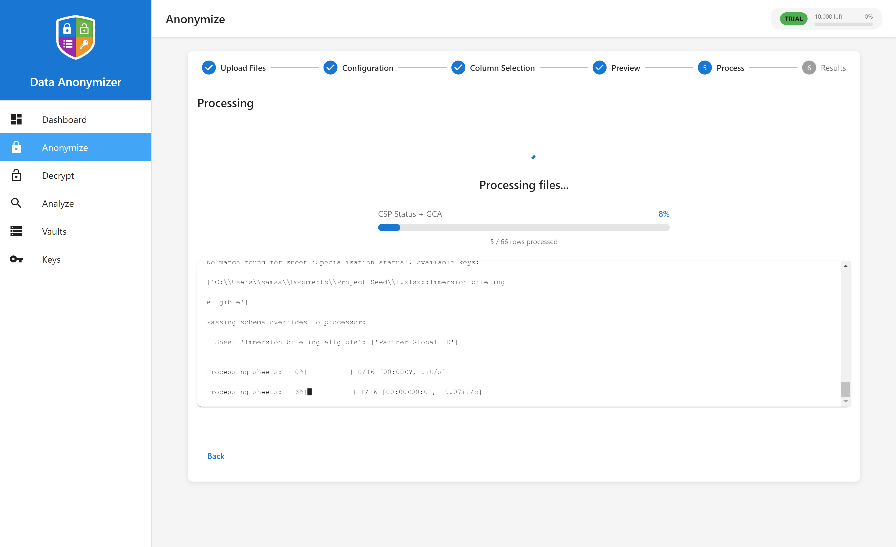
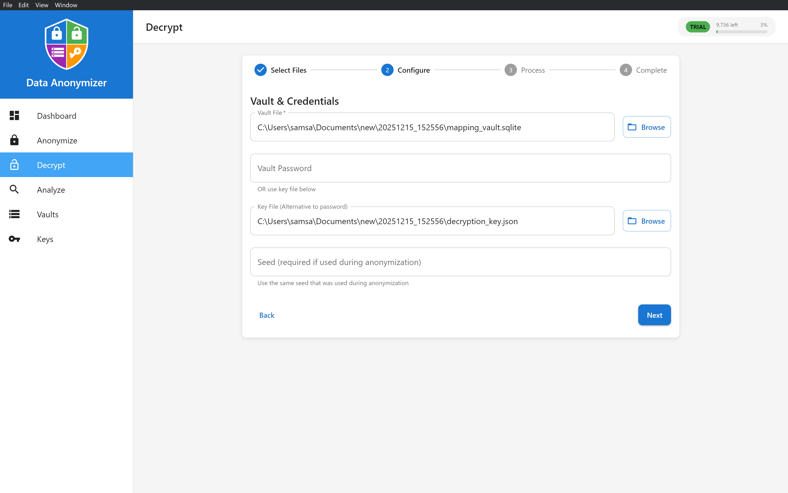
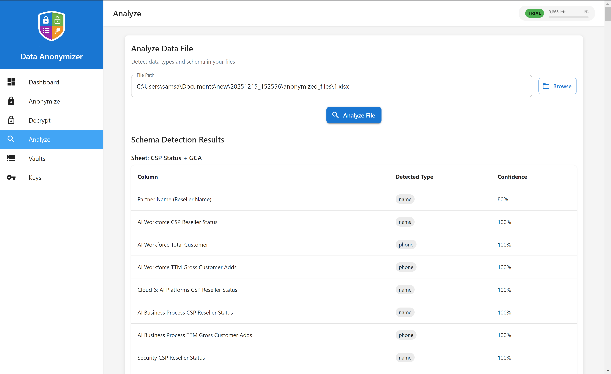
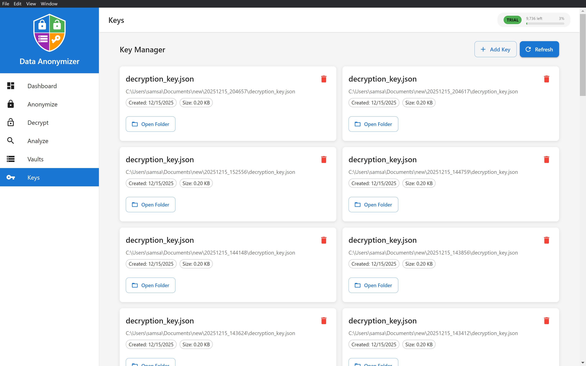

# Data Anonymizer - Desktop UI

**A modern, user-friendly desktop application for format-preserving data anonymization**

*Built with React, Material-UI, and Electron*

[Features](#-key-features) • [Screenshots](#-user-interface) • [Getting Started](#-getting-started) • [Documentation](#-documentation)

---

## 🎯 Overview

Data Anonymizer Desktop is a professional-grade desktop application that makes data anonymization simple and secure. With an intuitive graphical interface, step-by-step workflows, and real-time progress tracking, you can anonymize sensitive data without writing a single line of code.

**All processing happens locally on your machine** - your data never leaves your computer.

---

## ✨ Key Features

### 🔒 **Secure & Private**
- 100% local processing - no cloud dependencies
- No data transmission to external servers
- Enterprise-grade encryption with NIST-approved algorithms

### 📊 **Smart Data Detection**
- Automatic detection of 13+ sensitive data types
- Intelligent column analysis with confidence scores
- Support for emails, phones, names, credit cards, IBANs, UUIDs, addresses, and more

### 🎨 **Modern User Interface**
- Clean, intuitive Material Design interface
- Step-by-step wizards for complex workflows
- Real-time progress bars and status updates
- Responsive layout that works on all screen sizes

### 📁 **Multi-Format Support**
- **CSV files** - Standard comma-separated values
- **Excel files** - `.xlsx`, `.xls`, `.xlsm`, `.xlsb`, `.ods`
- **Multi-sheet Excel** - Process multiple sheets simultaneously
- Batch processing for multiple files

### 🔄 **Reversible Anonymization**
- Encrypted mapping vaults for data recovery
- Secure key management system
- Optional deterministic seeds for consistency

### ⚡ **Performance**
- Fast processing with progress tracking
- Chunked processing for large files
- Background processing with live output

---

## 🖥️ User Interface

### **Dashboard**

The central hub for all your anonymization needs. Get started quickly with one-click access to all features.

**Features:**
- Quick action cards for common tasks
- Vault and key management overview
- Recent activity tracking
- Feature highlights and tips

### **Anonymize Workflow**

A comprehensive 6-step wizard that guides you through the entire anonymization process.

#### **Step 1: Upload Files**
- Drag-and-drop or click to select files
- Support for multiple files simultaneously
- File preview with size information
- Remove files before processing

#### **Step 2: Configuration**
- **Profiles**: Choose from 5 pre-configured profiles
  - Default (Hybrid) - Balanced approach
  - GDPR Compliant - Regulatory compliance
  - Referential Integrity - Maintain relationships
  - Test Data - Fully synthetic
  - Fast Hash - Speed optimized

- **Modes**: Select anonymization strategy
  - Hybrid (Recommended) - Best balance
  - Format-Preserving Fake - Realistic synthetic data
  - Format-Preserving Encryption (FPE) - NIST-compliant
  - Seeded HMAC - Fast deterministic hashing

- **Vault Settings**:
  - Create new encrypted vault
  - Use existing vault for consistency
  - Optional password protection
  - Key file management

- **Options**:
  - Deterministic seed for reproducible results
  - Preserve domain grouping (for emails)
  - Fully synthetic mode (no vault)

#### **Step 3: Column Selection**
- Auto-detected column types with confidence scores
- Visual indicators for detected data types
- Manual type overrides for specific columns
- Bulk select/deselect functionality
- Sync columns by name across sheets
- Real-time column analysis

**Detected Types:**
- Email, Phone, Name, UUID, GUID
- Credit Card, IBAN, ABN
- Address, Date, Numeric ID
- Domain, Free Text, Unknown

#### **Step 4: Preview**
- Review all configuration settings
- Summary of files to process
- Column selection overview
- Profile and mode verification

#### **Step 5: Processing**
- Real-time progress bar with percentage
- Row-by-row processing counter
- Live output log (filtered for clarity)
- Current operation indicator
- Cancelable operations

#### **Step 6: Results**
- Success confirmation
- Output directory location
- Quick access to open output folder
- View full processing log
- Process another file option

### **Decrypt Workflow**

Restore anonymized data using your vault and decryption key.

**Features:**
- Auto-detection of vault and key files
- Multiple file decryption
- Password or key file authentication
- Seed requirement support
- Progress tracking during decryption
- Output directory selection

### **Analyze Tool**

Analyze files before anonymization to understand data structure.

**Capabilities:**
- Automatic schema detection
- Data type identification
- Confidence scoring
- Sample data preview
- Column statistics
- Excel multi-sheet analysis

### **Vault Manager**

Centralized management of all your encryption vaults.

**Features:**
- Automatic vault discovery
- Manual vault addition
- Vault metadata display (size, creation date)
- Quick folder access
- Vault deletion with warnings
- Refresh to scan for new vaults

### **Key Manager**

Manage decryption keys for secure vault access.

**Features:**
- Track all decryption keys
- Key file metadata
- Secure deletion with warnings
- Folder navigation
- Auto-discovery from output directories

---

## 🎨 UI Components

### **Navigation**

- **Sidebar Navigation**: Persistent sidebar with icon-based menu
- **Mobile Responsive**: Collapsible drawer for smaller screens
- **Active State**: Visual indication of current page
- **Trial Indicator**: Usage tracking for trial versions

### **Common UI Elements**

- **Cards**: Clean, elevated containers for content
- **Steppers**: Step-by-step progress indicators
- **Progress Bars**: Visual feedback for long operations
- **Alerts**: Contextual notifications (info, warning, error, success)
- **Dialogs**: Modal windows for confirmations
- **Data Tables**: Organized data presentation
- **Chips**: Label and status indicators
- **Tooltips**: Helpful information on hover

### **Color Scheme**

- **Primary**: Blue (#1976d2) - Main actions and links
- **Secondary**: Purple (#9c27b0) - Secondary actions
- **Success**: Green (#4caf50) - Success states
- **Warning**: Orange (#ff9800) - Warnings
- **Error**: Red (#f44336) - Errors

---

## 🚀 Getting Started

### **Installation**

1. Download the installer for your platform:
   - Windows: `Data Anonymizer Setup.exe`
   - macOS: `Data Anonymizer.dmg`
   - Linux: `Data Anonymizer.AppImage`

2. Run the installer and follow the on-screen instructions

3. Launch the application from your applications menu

### **First Run**

1. **Welcome Screen**: The dashboard appears on first launch
2. **Quick Start**: Click "Anonymize Data" to begin
3. **Trial Version**: If using trial, usage limits are displayed
4. **Get Started**: Follow the step-by-step wizard

### **Basic Workflow**

1. **Select Files**: Upload CSV or Excel files
2. **Configure**: Choose profile and settings
3. **Select Columns**: Review auto-detected types
4. **Preview**: Confirm settings
5. **Process**: Watch real-time progress
6. **Results**: Access anonymized files

---

## 📖 Detailed Feature Guide

### **Anonymization Profiles**

#### Default (Hybrid)
- **Best For**: General use, testing, development
- **Method**: Balanced approach using hybrid anonymization
- **Reversible**: ✅ Yes
- **Features**: Format-preserving with referential integrity

#### GDPR Compliant
- **Best For**: Production data requiring regulatory compliance
- **Method**: Strong encryption with vault-based mapping
- **Reversible**: ✅ Yes
- **Features**: Full GDPR Art. 4(5) pseudonymization support

#### Referential Integrity
- **Best For**: Database exports, related tables, analytics
- **Method**: Maintains relationships between records
- **Reversible**: ✅ Yes
- **Features**: Same input always produces same output

#### Test Data
- **Best For**: Test environments, demos, non-sensitive datasets
- **Method**: Generates realistic fake data
- **Reversible**: ❌ No
- **Features**: Fast processing, completely synthetic values

#### Fast Hash
- **Best For**: Large datasets where speed is priority
- **Method**: Cryptographic hashing for speed
- **Reversible**: ❌ No
- **Features**: Consistent output for same input

### **Anonymization Modes**

#### Hybrid (Recommended) ⭐
- **Security**: High
- **Format Preserving**: ✅ Yes
- **Reversible**: ✅ Yes
- **Speed**: Fast
- **Description**: Combines format-preserving encryption with realistic fake data generation

#### Format-Preserving Fake
- **Security**: Medium
- **Format Preserving**: ✅ Yes
- **Reversible**: ✅ Yes
- **Speed**: Fast
- **Description**: Generates realistic fake data matching original format

#### Format-Preserving Encryption (FPE)
- **Security**: Very High
- **Format Preserving**: ✅ Yes
- **Reversible**: ✅ Yes
- **Speed**: Medium
- **Description**: NIST SP 800-38G compliant AES-FF3-1 encryption

#### Seeded HMAC
- **Security**: High
- **Format Preserving**: ❌ No
- **Reversible**: ❌ No
- **Speed**: Very Fast
- **Description**: Uses HMAC-SHA256 with seed for consistent hashing

---

## 🔐 Security Features

### **Local Processing**
- All data processing occurs on your machine
- No internet connection required
- No data transmission to external servers

### **Encryption**
- AES-128 encryption for vaults
- PBKDF2 key derivation (100,000 iterations)
- Fernet authenticated encryption
- Secure random salt generation

### **Key Management**
- Separate key file storage
- Optional password protection
- Secure deletion with warnings
- Key file export/import

### **Privacy**
- No telemetry or analytics
- No usage data collection (except trial version locally)
- No file content transmission
- Complete user control

---

## 💡 Tips & Best Practices

### **Getting the Best Results**

1. **Use Analyze First**: Run the Analyze tool to understand your data structure
2. **Choose the Right Profile**: Match profile to your use case
3. **Review Column Detection**: Verify auto-detected types match your expectations
4. **Use Seeds for Consistency**: Use the same seed across multiple runs
5. **Backup Originals**: Always keep backups of original files

### **Security Recommendations**

1. **Strong Passwords**: Use 12+ character passwords for vaults
2. **Separate Storage**: Store vault and key files in different locations
3. **Secure Backups**: Encrypt backups of vaults and keys
4. **Access Control**: Restrict file system access to sensitive data
5. **Regular Updates**: Keep the application updated

### **Performance Optimization**

1. **Batch Processing**: Process multiple files in one session
2. **Column Selection**: Only anonymize necessary columns
3. **Large Files**: Use CSV format for very large datasets
4. **Progress Monitoring**: Use progress bars to track long operations

---

## 📱 System Requirements

### **Minimum Requirements**

- **OS**: Windows 10+
- **RAM**: 4 GB
- **Storage**: 500 MB free space

## 🐛 Troubleshooting

### **Common Issues**

**Application won't start?**
- Check system requirements
- Try running as administrator
- Check antivirus software isn't blocking

**Files not loading?**
- Verify file format is supported
- Check file isn't corrupted
- Ensure file isn't open in another application

**Processing is slow?**
- Close other applications
- Process smaller files first
- Check available disk space

**Progress bar stuck?**
- Wait for initialization (can take time for large files)
- Check system resources
- Review output log for errors

### **Getting Help**

- Open an issue on GitHub
- Check existing issues for solutions

---

## 🎯 Trial Version

The trial version includes all features with a processing limit:

- **Row Limit**: 10,000 rows total
- **Features**: All features available
- **Duration**: No time limit
- **Privacy**: 100% local, no data collection

**Upgrade Benefits:**
- Unlimited processing
- Priority support
- Additional features (coming soon)
---

## 🛠️ Technology Stack

### **Frontend**
- **React 18** - UI framework
- **Material-UI (MUI)** - Component library
- **React Router** - Navigation
- **Context API** - State management

### **Backend**
- **Electron** - Desktop framework
- **Python 3.8+** - Processing engine
- **SQLite** - Vault storage
- **Cryptography** - Encryption libraries

### **File Processing**
- **Pandas** - Data manipulation
- **OpenPyXL** - Excel file handling
- **CSV** - Standard library

---

## 📄 License

This project is licensed under the MIT License - see the [LICENSE](LICENSE) file for details.

---

**Made with ❤️ for data privacy and security**

[Report Bug](https://github.com/yourusername/data-anonymizer/issues) • [Request Feature](https://github.com/yourusername/data-anonymizer/issues) • [Documentation](README.md)

